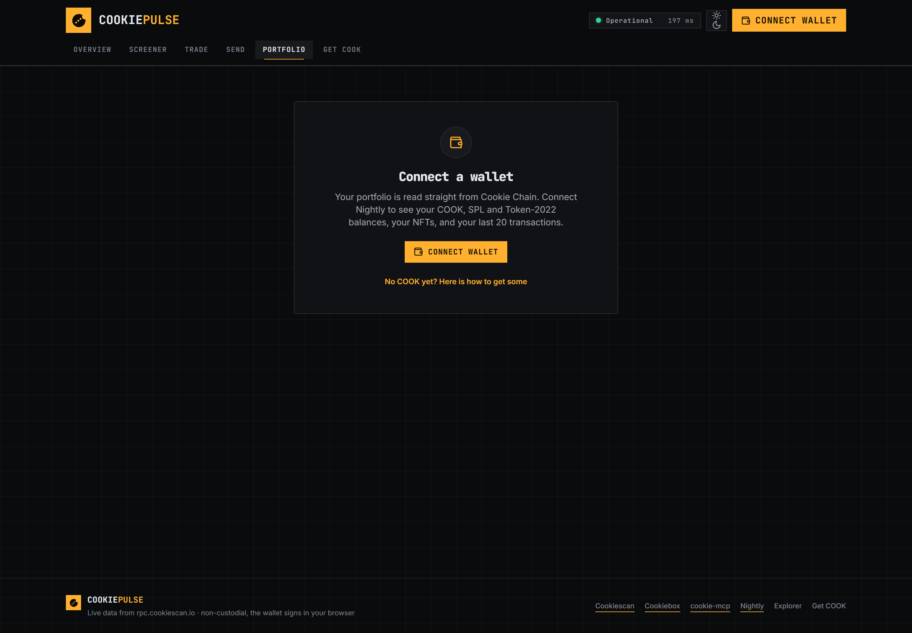

# 🍪 Cookie Pulse

**Watch the chain, trade the chain.** An analytics and trade terminal for
[Cookie Chain](https://cookiescan.io) — token screener, portfolio, real swaps through the Cookiebox
aggregator, and a live activity feed, all in one app.

**Live:** `<!-- paste your Vercel URL here -->`
**Repo:** `<!-- paste your GitHub URL here -->`

Connect with [Nightly](https://nightly.app), and every number on screen comes from Cookie Chain
mainnet — no mock data anywhere in this repo.

---

## Screenshots

| | |
| --- | --- |
|  |  |
| Overview — chain health, movers, TVL, live activity | Screener — every token on Cookie Chain |
|  |  |
| Trade — routed swaps with the full path shown | Portfolio — balances, NFTs, history |

---

## What it does

| Bounty requirement | Where it lives | How |
| --- | --- | --- |
| Connect a wallet (Nightly) | Header, every page | `@solana/wallet-adapter` with Nightly registered first; Wallet Standard autodetect stays on for other SVM wallets |
| Display the connected address | Header | Truncated address, copy button, Cookiescan link, live COOK balance |
| Transaction execution | `/send`, `/trade` | `SystemProgram.transfer`, SPL / Token-2022 `transferChecked`, and Cookiebox-routed swaps |
| Transaction confirmation handling | `useTransaction` | `confirmTransaction` with the builder's `blockhash` + `lastValidBlockHeight`, at `confirmed` |
| Error handling and user feedback | `useTransaction`, `lib/errors.ts` | One toast through six states; every failure mapped to plain language, with simulation logs |
| View app-specific data and activity | `/portfolio`, Activity panel | Balances across both token programs, NFTs via DAS, last 20 transactions, live DEX feed |
| Analytics, dashboards | `/`, `/screener` | Chain health, movers, TVL by venue, sortable 6,470-token screener |
| Use existing Cookie Chain programs | `/trade` | Cookiebox aggregator routes through Cookiebox DAMM/CLMM and Cookieswap pools |
| Cookiebox / Cookiescan / DAS / cookie-mcp | throughout | Cookiebox agg for swaps, Cookiescan REST + DAS for data, cookie-mcp logic ported and credited |
| Deployed and publicly accessible | Vercel | Runs with zero configuration — every env var has a working default |
| Open source + README | this repo | MIT |

### The six routes

1. **`/` Overview** — chain health from *one* batched JSON-RPC request (status, slots/sec,
   finalization lag, validators, RPC latency), COOK price, top gainers / losers / volume, total TVL
   with a per-venue breakdown, and a live activity feed across all five DEX programs.
2. **`/screener`** — all 6,470 registry tokens: price, 24h change, volume, liquidity, market cap,
   holders. Search, sortable columns, click-to-copy mints, one-click through to a pre-filled trade.
3. **`/portfolio`** — COOK plus every SPL **and** Token-2022 balance priced in USD, NFTs via the DAS
   API, and your last 20 transactions with fees and explorer links.
4. **`/send`** — send COOK or any token you hold, with an optional memo. Address validation, MAX with
   a fee reserve, decimal-exact amounts.
5. **`/trade`** — swap panel with searchable token pickers, slippage chips, a debounced quote that
   refreshes while idle, and the full route displayed (venues, hops, split %) before you sign.
6. **`/bridge`** — a four-step "how to get COOK" guide with a copy button on every value. A banner
   links here from every page whenever a connected wallet holds no COOK.

---

## Architecture

```
      browser                          Next.js route handlers          upstream
 ┌────────────────┐                  ┌────────────────────────┐
 │ wallet-adapter │──── signs ──────▶│                        │
 │ React Query    │                  │  /api/tokens           │──▶ api.cookiescan.io
 │ pages          │──── /api/* ─────▶│  /api/markets          │    (REST + DAS)
 │                │                  │  /api/price/cook       │
 │                │                  │  /api/quote            │──▶ agg.cookiebox.app
 │                │                  │  /api/swap-tx          │    (quote + unsigned v0 tx)
 │                │                  │  /api/das              │
 │                │                  └────────────────────────┘
 │                │
 │                │──── JSON-RPC (batched) ──────────────────────▶ rpc.cookiescan.io
 └────────────────┘
```

Third-party HTTP is proxied (CORS, caching, one place for fallbacks). Chain reads go straight to the
RPC so they stay live. **No private key ever touches a server — the wallet signs in the browser.**

Longer version: [`docs/ARCHITECTURE.md`](docs/ARCHITECTURE.md). Assumptions and everything that
differs from the original spec: [`NOTES.md`](NOTES.md).

---

## Run locally

```bash
git clone <this repo> cookie-pulse && cd cookie-pulse
npm install
npm run dev
```

Open <http://localhost:3000>. **No `.env` is needed** — every variable defaults to the public Cookie
Chain endpoints. Copy `.env.example` to `.env.local` only if you want to point somewhere else.

```bash
npm run build      # production build
npm run lint       # eslint
npm run typecheck  # tsc --noEmit
npm run smoke      # shape-checks every /api/* route against a running dev server
```

`npm run smoke` needs `npm run dev` running in another terminal. It asserts that the registry is
non-empty, that COOK's price is a number, that the markets feed carries TVL, and that a real
COOK → top-volume-token quote comes back with a route.

### Optional reference clone

The API clients port logic from [`cookie-mcp`](https://github.com/cookiechain/cookie-mcp). It is not
required to build or run, but to read alongside the source:

```bash
git clone https://github.com/cookiechain/cookie-mcp vendor/cookie-mcp
```

### Deploy

Import the repo on Vercel and deploy. Framework preset Next.js, Node 20+, no environment variables
required.

---

## Add Cookie Chain to Nightly

1. Install [Nightly](https://nightly.app) and create or import a wallet.
2. Open **Settings → Networks → Solana** and add a custom RPC:
   - **Name** — `Cookie Chain`
   - **RPC** — `https://rpc.cookiescan.io`
   - **WebSocket** — `wss://wss.cookiescan.io`
3. Reconnect on Cookie Pulse. Your COOK balance appears in the header.

## Get COOK

Cookie Chain is **mainnet only** — there is no faucet and no devnet, so every transaction spends real
COOK. Fees are about **0.000005 COOK per signature**, so a few dollars covers a lot of testing.

1. Buy SOL and withdraw it to your Nightly wallet on **Solana**.
2. Swap SOL → COOK on [jup.ag](https://jup.ag). COOK on Solana is a **Token-2022** mint with 6
   decimals: `36ZrtQoab5MhhySaP1YSTwUahSk6GRVUTtZ6cuVfm9e1`.
3. Bridge to Cookie Chain at [hyperlane.cookiescan.io](https://hyperlane.cookiescan.io). It arrives
   as native COOK (9 decimals).
4. Add the Cookie Chain RPC to Nightly (above).

The in-app [`/bridge`](/bridge) page walks through the same four steps with a copy button on every
value.

---

## Addresses and endpoints

**Network**

| | |
| --- | --- |
| RPC | `https://rpc.cookiescan.io` |
| WebSocket | `wss://wss.cookiescan.io` |
| Explorer | `https://cookiescan.io` |
| Native token | COOK, 9 decimals, mint `So11111111111111111111111111111111111111112` |
| COOK on Solana | `36ZrtQoab5MhhySaP1YSTwUahSk6GRVUTtZ6cuVfm9e1` (Token-2022, 6 decimals) |
| Hyperlane domains | Cookie `420042004` · Solana `1399811149` |

**APIs**

| | |
| --- | --- |
| Cookiescan REST + DAS | `https://api.cookiescan.io` |
| Cookiebox aggregator | `https://agg.cookiebox.app` |
| Candy Shop (fallback, not wired) | `https://swap.cookiescan.io/api` |

**Programs**

| Program | Id |
| --- | --- |
| Cookiebox DAMM | `DAMMjDCEFTDkt7ywazZS8GoaLtjb3HaJo3pLbf64xrPY` |
| Cookiebox CLMM | `CLMMmWqTtyNSomqXP3kETJy2SGKPdr31USsm4GfbLyKs` |
| Cookieswap BAMM | `WTzkPUoprVx7PDc1tfKA5sS7k1ynCgU89WtwZhksHX5` |
| Cookieswap xYBN | `xYBN2zddsqSy41tg1yD9nJScCmqquZnHUyzXBfLEqC8` |
| MomoSwap launchpad | `momoL7wu4TrXjnXMLCLzGsbx8Pm7XGgoYo7FVqDoqcw` |
| SPL Token | `TokenkegQfeZyiNwAJbNbGKPFXCWuBvf9Ss623VQ5DA` |
| Token-2022 | `TokenzQdBNbLqP5VEhdkAS6EPFLC1PHnBqCXEpPxuEb` |
| Memo | `MemoSq4gqABAXKb96qnH8TysNcWxMyWCqXgDLGmfcHr` (verified deployed) |

---

## Notes on the data

Cookie Chain is young, and the app is built for what is actually there rather than for a busy chain.
Of 6,470 tokens in the registry, **92 carry a USD price and 3 have non-zero 24h volume**; total TVL
across 160 pools is roughly **$8,478**. The movers tiles therefore show real empty states instead of
padding with zero-change rows, and the screener hides unpriced tokens by default with a toggle to
show all.

One correction worth flagging: `marketData.liquidity` on `/api/tokens` is **already denominated in
USD**, not COOK. Treating it as COOK and multiplying by COOK's price understates liquidity by about
8,400×. Measured against the markets feed — bCOOK reads `3861.16` in the registry against a pool sum
of `3863.45` USD. Full working in [`NOTES.md`](NOTES.md).

---

## Tech

Next.js 15 (App Router) · TypeScript strict · Tailwind · `@solana/web3.js` v1 · `@solana/spl-token` ·
`@solana/wallet-adapter` (+ Nightly) · TanStack Query · sonner · lucide-react. No chart library —
there is no historical data endpoint to chart.

## Credits

- **[cookie-mcp](https://github.com/cookiechain/cookie-mcp)** (MIT) — the reference implementation
  for the Cookiescan and Cookiebox clients. The unwrap rules, HTTP retry policy, health derivation
  and confirm semantics in `src/lib/` are ported from it.
- **[Cookiescan](https://cookiescan.io)** — RPC, explorer, token registry, markets feed, DAS API.
- **[Cookiebox](https://cookiebox.app)** — the swap aggregator that routes every trade.
- **[Nightly](https://nightly.app)** — wallet.

## License

MIT — see [LICENSE](LICENSE).
