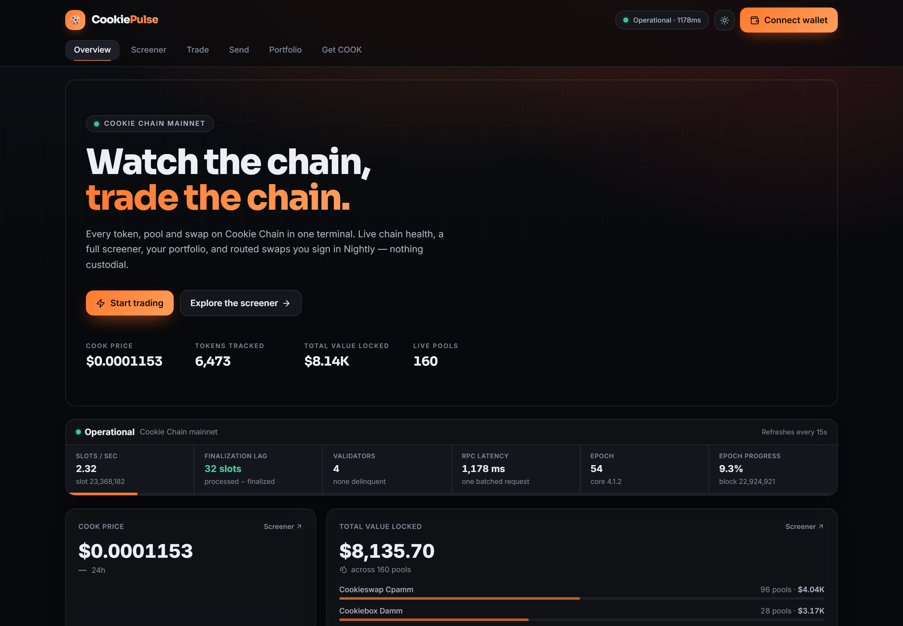
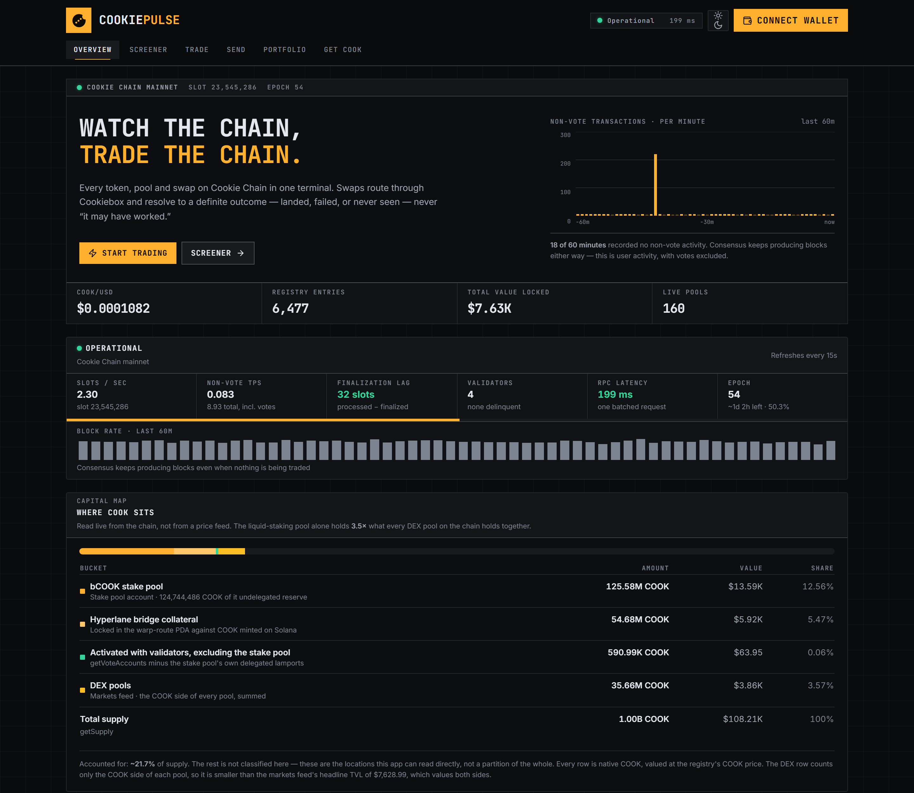
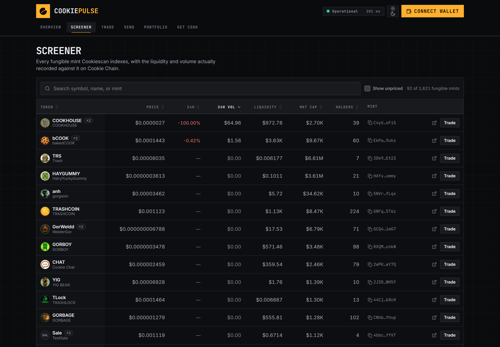
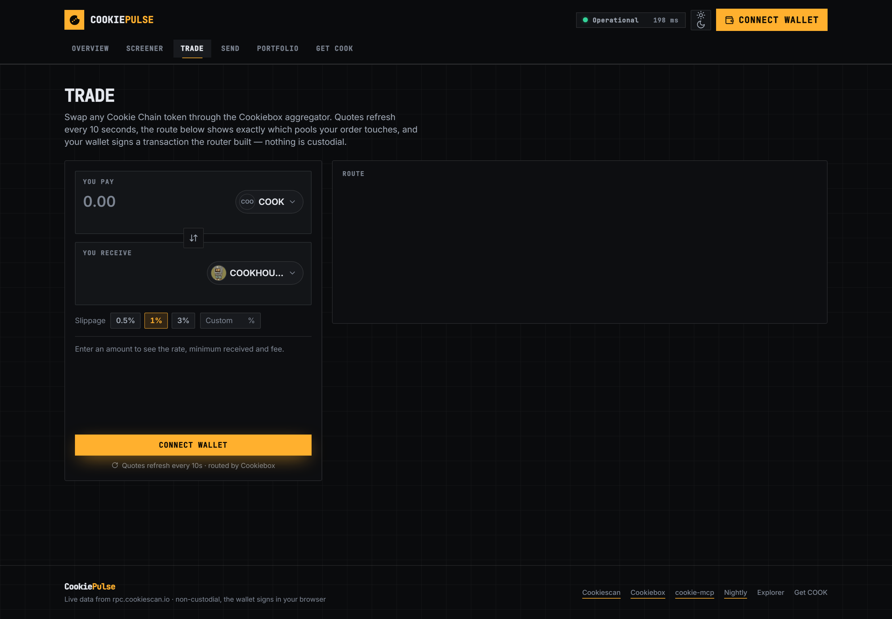

# 🍪 Cookie Pulse

**Watch the chain, trade the chain.** An analytics and trade terminal for
[Cookie Chain](https://cookiescan.io) — token screener, portfolio, real swaps through the Cookiebox
aggregator, and a live activity feed, all in one app.

**Live:** <https://cookie-pulse-ayushdhiman9997-8957s-projects.vercel.app>
**Repo:** <https://github.com/AtharvDhiman/cookie-pulse>

Connect with [Nightly](https://nightly.app), and every number on screen comes from Cookie Chain
mainnet — no mock data anywhere in this repo.

---

## Screenshots

| | |
| --- | --- |
|  |  |
| Overview — live chain stats above the dashboard | Analytics — health strip, TVL by venue, movers, activity feed |
|  |  |
| Screener — all 6,473 registry tokens, sortable | Trade — a live Cookiebox quote split across three pools |

Every shot is Cookie Chain mainnet against a production build. `docs/screenshots/` also carries
`portfolio.png`, `send.png` and `bridge.png` — Portfolio and Send show their connect-a-wallet state,
because a populated one needs a funded wallet.

They are regenerated with `npm run shots`, not taken by hand — the first set went nineteen commits
stale and was still advertising a build without the sparklines, the capital map or the drawn mark.
The script scrolls each route to the bottom and back before capturing, because everything below the
fold sits at opacity 0 until its observer fires, and it exits non-zero if any reveal target is still
hidden. It also forces `prefers-reduced-motion`, so two captures of the same route are identical.

---

## What it does

| Bounty requirement | Where it lives | How |
| --- | --- | --- |
| Connect a wallet (Nightly) | Header, every page | `@solana/wallet-adapter` with Nightly registered first; Wallet Standard autodetect stays on for other SVM wallets |
| Display the connected address | Header | Truncated address, copy button, Cookiescan link, live COOK balance |
| Transaction execution | `/send`, `/trade` | `SystemProgram.transfer`, SPL / Token-2022 `transferChecked`, and Cookiebox-routed swaps |
| Transaction confirmation handling | `useTransaction` | `confirmTransaction` with the builder's `blockhash` + `lastValidBlockHeight`, at `confirmed` |
| Error handling and user feedback | `useTransaction`, `lib/errors.ts` | One toast through six states; every failure mapped to plain language, with simulation logs |
| View app-specific data and activity | `/portfolio`, Activity panel | Balances across both token programs, NFTs via DAS, last 20 transactions, live DEX feed |
| Analytics, dashboards | `/`, `/screener` | Chain health, non-vote TPS, 60-minute sparklines, the capital map, movers, TVL by venue, and a sortable screener over the whole registry |
| Use existing Cookie Chain programs | `/trade` | Cookiebox aggregator routes through Cookiebox DAMM/CLMM and Cookieswap pools |
| Cookiebox / Cookiescan / DAS / cookie-mcp | throughout | Cookiebox agg for swaps, Cookiescan REST + DAS for data, cookie-mcp logic ported and credited |
| Deployed and publicly accessible | Vercel | Runs with zero configuration — every env var has a working default |
| Open source + README | this repo | MIT |

### The six routes

1. **`/` Overview** — chain health from *one* batched JSON-RPC request: status, slots/sec,
   finalization lag, validators, RPC latency, **non-vote TPS beside total TPS**, an epoch ETA, and
   two 60-minute inline-SVG sparklines. Plus COOK price, movers, TVL by venue, a live activity feed
   across all five DEX programs, and the **capital map**.
2. **`/screener`** — the whole registry: price, 24h change, volume, liquidity, market cap, holders,
   and a neutral badge when a symbol is shared by other mints. Search by name, symbol or mint,
   sortable columns, click-to-copy mints, one-click through to a pre-filled trade.
3. **`/portfolio`** — COOK plus every SPL **and** Token-2022 balance priced in USD, NFTs via the DAS
   API, and your last 20 transactions with fees and explorer links.
4. **`/send`** — send COOK or any token you hold, with an optional memo. Address validation, MAX with
   a fee reserve, decimal-exact amounts.
5. **`/trade`** — swap panel with searchable token pickers, slippage chips, a debounced quote that
   refreshes while idle, the full route (venues, hops, split %) before you sign, on-chain facts about
   the token you are receiving, and a confirmed card that outlives the toast.
6. **`/bridge`** — a four-step "how to get COOK" guide with a copy button on every value. A banner
   links here from every page whenever a connected wallet holds no COOK.

### Three things worth opening the app for

**The WebSocket was pointed at a dead host.** `wss://wss.cookiescan.io` — the endpoint the brief
states as fact — serves a TLS certificate for an unrelated domain and never upgrades. Measured
through this repo's own `@solana/web3.js`: **0 slot events in 10 s against 17 from
`wss://rpc.cookiescan.io`**, with six `Hostname/IP does not match certificate's altnames` errors.
`confirmTransaction`'s status fallback is gated behind a subscription that never resolves on that
socket, so every successful transaction was heading for a timeout. Fixed, and documented in
[`NOTES.md`](NOTES.md).

**Every transaction resolves to a definite outcome.** Landed, failed on-chain, or never seen —
never "it may have worked". A blockhash-strategy confirm runs as a backstop while a throttled
`getSignatureStatuses` poll races it. "Never seen" is the only verdict whose UI says it is safe to
send again, so it requires two consecutive corroborating rounds and re-reads the status *after*
observing the blockhash die — a transaction that lands between those two calls must not be reported
as missing.

**The capital map answers "why does this chain look empty".** The DEX pools everyone measures are
not where the COOK is: the bCOOK stake pool holds ~125M COOK, several times what sits in every DEX
pool on the chain combined. The card states that multiple as a figure derived from the two rows it
renders, never as prose — an earlier hard-coded "fifteen times" came from comparing a COOK balance
against a USD one and had gone stale in four files. Every row names its on-chain source, the stake
pool's undelegated reserve is called a reserve rather than "staked", a source that fails renders
"unavailable" rather than zero, and the card states what share of supply it actually accounts for
instead of implying the buckets sum to it.

---

## Architecture

```
      browser                          Next.js route handlers          upstream
 ┌────────────────┐                  ┌────────────────────────┐
 │ wallet-adapter │──── signs ──────▶│                        │
 │ React Query    │                  │  /api/tokens           │──▶ api.cookiescan.io
 │ pages          │──── /api/* ─────▶│  /api/markets          │    (REST + DAS)
 │                │                  │  /api/price/cook       │
 │                │                  │  /api/quote            │──▶ agg.cookiebox.app
 │                │                  │  /api/swap-tx          │    (quote + unsigned v0 tx)
 │                │                  │  /api/das              │
 │                │                  └────────────────────────┘
 │                │
 │                │──── JSON-RPC (batched) ──────────────────────▶ rpc.cookiescan.io
 └────────────────┘
```

Third-party HTTP is proxied (CORS, caching, one place for fallbacks). Chain reads go straight to the
RPC so they stay live. **No private key ever touches a server — the wallet signs in the browser.**

Longer version: [`docs/ARCHITECTURE.md`](docs/ARCHITECTURE.md). Assumptions and everything that
differs from the original spec: [`NOTES.md`](NOTES.md).

---

## Run locally

```bash
git clone https://github.com/AtharvDhiman/cookie-pulse && cd cookie-pulse
npm install
npm run dev
```

Open <http://localhost:3000>. **No `.env` is needed** — every variable defaults to the public Cookie
Chain endpoints. Copy `.env.example` to `.env.local` only if you want to point somewhere else.

```bash
npm run build         # production build
npm run lint          # eslint
npm run typecheck     # tsc --noEmit
npm test              # error mapping, confirmation verdicts, token-safety copy — no network
npm run check:health  # the live health batch: one POST, its size, and every derived figure
npm run smoke         # shape-checks every /api/* route against a running dev server
npm run shots         # recapture docs/screenshots/ against a running production build
```

`npm test` runs three suites that need no wallet and no network: `test:errors` (41 assertions over
the error mapping, including that a router's custom error 1 is not reported as "not enough COOK"),
`test:confirm` (12, including a regression guard that the confirmation poll stays throttled — it
once issued millions of requests once its backstop settled), and `test:safety` (13, over the rules
that keep the token-safety copy factual).

`npm run smoke` needs `npm run dev` running in another terminal. It asserts that the registry is
non-empty, that COOK's price is a number, that the markets feed carries TVL, and that a real
COOK → top-volume-token quote comes back with a route. It defaults to `http://localhost:3000`;
point it anywhere else — another port, or the deployed URL — with `BASE_URL=…`:

```bash
BASE_URL=https://cookie-pulse-ayushdhiman9997-8957s-projects.vercel.app npm run smoke
```

On PowerShell the inline-variable prefix is not a thing, so:

```bash
$env:BASE_URL="https://cookie-pulse-ayushdhiman9997-8957s-projects.vercel.app"; npm run smoke
```

Run against the deployment above: **29 passed, 0 failed**.

`npm run shots` drives headless Chrome over CDP and takes the base URL as its argument
(`npm run shots -- http://localhost:3000`). It adds no dependency: `chrome-launcher` is already in
the tree and Node 22 ships a global `WebSocket`.

### Optional reference clone

The API clients port logic from [`cookie-mcp`](https://github.com/cookiechain/cookie-mcp). It is not
required to build or run, but to read alongside the source:

```bash
git clone https://github.com/cookiechain/cookie-mcp vendor/cookie-mcp
```

### Deploy

Import the repo on Vercel and deploy. Framework preset Next.js, Node 20+, no environment variables
required.

---

## Add Cookie Chain to Nightly

1. Install [Nightly](https://nightly.app) and create or import a wallet.
2. Open **Settings → Networks → Solana** and add a custom RPC:
   - **Name** — `Cookie Chain`
   - **RPC** — `https://rpc.cookiescan.io`
   - **WebSocket** — `wss://rpc.cookiescan.io` (the RPC host also serves the socket; the `wss.`
     subdomain the chain docs list does not upgrade — see NOTES.md)
3. Reconnect on Cookie Pulse. Your COOK balance appears in the header.

## Get COOK

Cookie Chain is **mainnet only** — there is no faucet and no devnet, so every transaction spends real
COOK. Fees are about **0.000005 COOK per signature**, so a few dollars covers a lot of testing.

1. Buy SOL and withdraw it to your Nightly wallet on **Solana**.
2. Swap SOL → COOK on [jup.ag](https://jup.ag). COOK on Solana is a **Token-2022** mint with 6
   decimals: `36ZrtQoab5MhhySaP1YSTwUahSk6GRVUTtZ6cuVfm9e1`.
3. Bridge to Cookie Chain at [hyperlane.cookiescan.io](https://hyperlane.cookiescan.io). It arrives
   as native COOK (9 decimals).
4. Add the Cookie Chain RPC to Nightly (above).

The in-app [`/bridge`](/bridge) page walks through the same four steps with a copy button on every
value.

---

## Addresses and endpoints

**Network**

| | |
| --- | --- |
| RPC | `https://rpc.cookiescan.io` |
| WebSocket | `wss://rpc.cookiescan.io` (the RPC host — the `wss.` subdomain is dead, see NOTES.md) |
| Explorer | `https://cookiescan.io` |
| Native token | COOK, 9 decimals, mint `So11111111111111111111111111111111111111112` |
| COOK on Solana | `36ZrtQoab5MhhySaP1YSTwUahSk6GRVUTtZ6cuVfm9e1` (Token-2022, 6 decimals) |
| Hyperlane domains | Cookie `420042004` · Solana `1399811149` |

**APIs**

| | |
| --- | --- |
| Cookiescan REST + DAS | `https://api.cookiescan.io` |
| Cookiebox aggregator | `https://agg.cookiebox.app` |
| Candy Shop (fallback, not wired) | `https://swap.cookiescan.io/api` |

**Programs**

| Program | Id |
| --- | --- |
| Cookiebox DAMM | `DAMMjDCEFTDkt7ywazZS8GoaLtjb3HaJo3pLbf64xrPY` |
| Cookiebox CLMM | `CLMMmWqTtyNSomqXP3kETJy2SGKPdr31USsm4GfbLyKs` |
| Cookieswap BAMM | `WTzkPUoprVx7PDc1tfKA5sS7k1ynCgU89WtwZhksHX5` |
| Cookieswap xYBN | `xYBN2zddsqSy41tg1yD9nJScCmqquZnHUyzXBfLEqC8` |
| MomoSwap launchpad | `momoL7wu4TrXjnXMLCLzGsbx8Pm7XGgoYo7FVqDoqcw` |
| SPL Token | `TokenkegQfeZyiNwAJbNbGKPFXCWuBvf9Ss623VQ5DA` |
| Token-2022 | `TokenzQdBNbLqP5VEhdkAS6EPFLC1PHnBqCXEpPxuEb` |
| Memo | `MemoSq4gqABAXKb96qnH8TysNcWxMyWCqXgDLGmfcHr` (verified deployed) |

---

## Notes on the data

Cookie Chain is young, and the app is built for what is actually there rather than for a busy chain.
Of 6,470 tokens in the registry, **92 carry a USD price and 3 have non-zero 24h volume**; total TVL
across 160 pools is roughly **$8,478**. The movers tiles therefore show real empty states instead of
padding with zero-change rows, and the screener hides unpriced tokens by default with a toggle to
show all.

One correction worth flagging: `marketData.liquidity` on `/api/tokens` is **already denominated in
USD**, not COOK. Treating it as COOK and multiplying by COOK's price understates liquidity by about
8,400×. Measured against the markets feed — bCOOK reads `3861.16` in the registry against a pool sum
of `3863.45` USD. Full working in [`NOTES.md`](NOTES.md).

---

## Wallet test checklist

Everything that does not need a signature is verified: **29/29 API smoke checks pass against the
live deployment**, `tsc`, `eslint` and `next build` are clean, and 69 unit assertions cover the
error mapping, the confirmation verdicts and the token-safety copy.

The signature paths are written to be correct by construction and are covered by unit tests, but
have **not** been run against a funded wallet. That is the one gap. Work through this against the
live app — <https://cookie-pulse-ayushdhiman9997-8957s-projects.vercel.app> — or a local `npm run dev`; total cost is a fraction of a cent.

**Setup**
- [ ] Nightly installed, Cookie Chain RPC added (Settings → Networks → Solana), a little COOK bridged in.

**WebSocket — do this before anything that signs**
- [ ] The `/bridge` WebSocket row reads `wss://rpc.cookiescan.io`. Confirmation depends on that
      socket: on the `wss.` host it never upgrades and every successful transaction sits at
      "Confirming" until the blockhash expires (~69 s), then reports as a probable failure.
- [ ] After the first Send below confirms, note how long "Confirming" lasted. A healthy socket
      resolves in a slot or two; anything near 69 s means the subscription never came up.

**Connect**
- [ ] Nightly appears first in the wallet modal and connects.
- [ ] Header shows the truncated address, copy button, Cookiescan link and live COOK balance.
- [ ] The chain-status dot is green and the latency reads plausibly.
- [ ] Disconnect and reconnect cleanly.

**Send — the simplest real transaction, do this first**
- [ ] Send `0.001` COOK to your own address. Toast walks Building → Approve in Nightly → Simulating →
      Sending → Confirming → Confirmed, then links to Cookiescan.
- [ ] Open the link; the transaction is there and succeeded.
- [ ] Add a memo and send again — confirm the memo shows on the explorer.
- [ ] Press MAX on COOK: it must leave 0.001 COOK behind, not empty the wallet.
- [ ] Reject the signature in Nightly → "Transaction cancelled in Nightly."
- [ ] Paste a malformed address → inline "Not a valid address", button stays disabled.
- [ ] If you hold any SPL token, send a small amount to a **fresh** address (this exercises the
      idempotent ATA create). Check the recipient's balance on Cookiescan.

**Trade — the highest-risk path**
- [ ] `/trade` pre-fills COOK → the top-volume token. A quote appears within ~1s and refreshes.
- [ ] The route panel shows venue, pool and split; min received and fee are populated.
- [ ] Swap ~0.05 COOK. Sign in Nightly → confirmed toast → Cookiescan link resolves.
- [ ] Balances in the header and `/portfolio` update on their own after it confirms.
- [ ] Set slippage to 0.5% on a thin pair and try to trigger the slippage error → should read
      "Price moved more than your slippage" with a button that raises it to 3%.
- [ ] Deep link works: `/trade?in=So11111111111111111111111111111111111111112&out=<some mint>`.

**Portfolio**
- [ ] COOK balance, every SPL and Token-2022 balance, and the USD total look right.
- [ ] Token-2022 holdings carry the Token-2022 pill.
- [ ] The last 20 transactions list with fees and working explorer links.
- [ ] Refresh button updates without a page reload.

**Zero-COOK path** (use a second, empty wallet)
- [ ] The amber "No COOK in this wallet" banner appears on every page and links to `/bridge`.
- [ ] Attempting a swap surfaces "Not enough COOK to pay fees." with a `/bridge` link.

**Presentation**
- [ ] All six routes at 360px wide — no sideways scrolling of the page itself.
- [ ] Light/dark toggle on every route.
- [ ] Retake `docs/screenshots/portfolio.png` with Nightly connected — the committed shot is
      the connect-a-wallet state, which is all that can be captured without a funded wallet.

> If something fails, the fastest useful report is: **which page, what you clicked, the exact toast
> text, and the browser console error.**

## Security

**Headers.** `next.config.mjs` sets a CSP, HSTS, `nosniff`, `X-Frame-Options: DENY`,
`Referrer-Policy`, `Permissions-Policy` and COOP, and disables `X-Powered-By`. The frame protection
is the one that matters most here: without it `/trade` and `/send` could be iframed and overlaid,
on pages where people sign transactions.

The CSP is specific to this app rather than copied:

- `script-src` needs `'unsafe-inline'`. Every route is statically prerendered, so Next emits no
  per-request nonce, and the RSC flight payload's hash changes on every build — neither a nonce nor
  a hash allowlist is available without making the whole app dynamic.
- `'unsafe-eval'` is added **in development only**. `next dev` runs webpack with
  `eval-source-map`, which wraps every client module in `eval()`; without the gate `npm run dev`
  renders a blank page. It is never sent in production.
- `style-src` and `font-src` are `'self'` only. `@solana/wallet-adapter-react-ui`'s stylesheet
  `@import`s Google Fonts on line 1, which fires at CSS parse time on every route — so it is
  vendored in `src/styles/wallet-adapter.css` with that line removed and the modal pointed at the
  app's own face. Measured afterwards: zero requests to `fonts.googleapis.com` or
  `fonts.gstatic.com`, and `rpc.cookiescan.io` is the only external origin the app touches.
- `img-src` allows `https:`. Token logos and NFT art are arbitrary off-chain URLs from a
  third-party registry; this is the one directive that cannot be narrowed without breaking the
  screener.
- `usb`/`hid` are deliberately left enabled — Wallet Standard autodetection is on and a
  hardware-wallet adapter needs WebHID — and COOP is `same-origin-allow-popups`, because a Wallet
  Standard web wallet talks to its popup through `window.opener`.

Verified: zero CSP violations across all six routes.

HSTS deliberately omits `preload`, which is a one-way commitment binding the apex and every sibling
subdomain to HTTPS and does nothing until the domain is submitted to hstspreload.org. Add it at the
moment of submission. If the Vercel preview toolbar is left enabled it needs `vercel.live` in
`script-src`/`connect-src`.

**Secrets.** There are none. Every endpoint is public and every environment variable has a working
default, so the app runs with no `.env` at all. Verified: no server-only variable name and no
key-shaped string appears anywhere in `.next/static/`, and only `.env.example` is tracked.

**Dependencies.** `npm audit` reports 27 advisories. Almost none is reachable from the deployed app,
which was checked against the build output rather than assumed:

| Package | Severity | In the client bundle |
| --- | --- | --- |
| `react-native`, `metro`, `image-size` | high | **0 files** — pulled in by the mobile wallet adapter, never bundled for web |
| `bigint-buffer` | high | **0 files** |
| `postcss` | high | devDependency; build-time only |

`npm audit fix --force` would install `@solana/spl-token@0.1.8` and `next@16`, both breaking, and
would break the wallet adapter for no security gain. Reachability is documented here instead.

---

## Tech

Next.js 15 (App Router) · TypeScript strict · Tailwind · `@solana/web3.js` v1 · `@solana/spl-token` ·
`@solana/wallet-adapter` (+ Nightly) · TanStack Query · sonner · lucide-react. No chart library —
there is no historical data endpoint to chart.

## Credits

- **[cookie-mcp](https://github.com/cookiechain/cookie-mcp)** (MIT) — the reference implementation
  for the Cookiescan and Cookiebox clients. The unwrap rules, HTTP retry policy, health derivation
  and confirm semantics in `src/lib/` are ported from it.
- **[Cookiescan](https://cookiescan.io)** — RPC, explorer, token registry, markets feed, DAS API.
- **[Cookiebox](https://cookiebox.app)** — the swap aggregator that routes every trade.
- **[Nightly](https://nightly.app)** — wallet.

## License

MIT — see [LICENSE](LICENSE).
